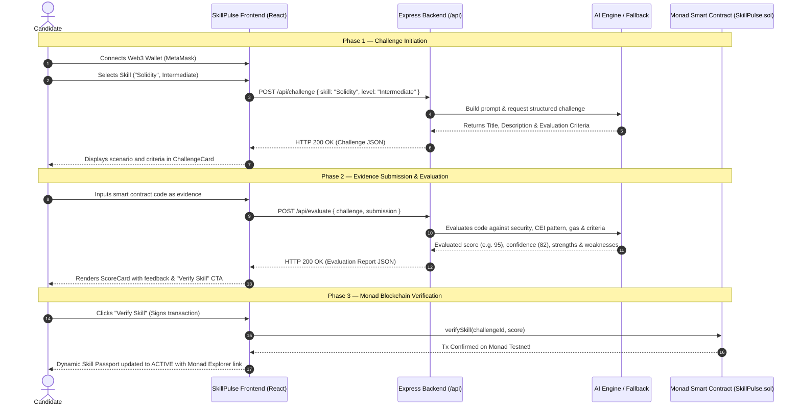

<div align="center">

# ⚡ SkillPulse
### *"Skills change. Proof should stay alive."*

[-836EF9?style=for-the-badge&logo=ethereum&logoColor=white)](https://testnet.monadexplorer.com)
[](https://www.typescriptlang.org/)
[](https://nodejs.org/)
[](https://expressjs.com/)
[](https://zod.dev/)
[](https://github.com/VorugantiRahul/xyz)
[](https://opensource.org/licenses/MIT)

<p align="center">
  <b>An AI-powered continuous skill verification platform anchored on the Monad blockchain.</b>
  <br />
  Transforming static one-time credentials into dynamic, living proofs of real-time technical competence.
</p>

[What We Built](#-what-we-built--accomplished) • [Tech Stack](#-complete-tech-stack) • [End-to-End Workflow](#-end-to-end-system-workflow) • [API Contracts](#-api-endpoints--contracts) • [Getting Started](#-getting-started--testing)

---

</div>

## 📌 Executive Summary

Traditional certificates prove you passed an assessment at a single point in time, but they cannot prove that you can reliably execute that skill today. 

**SkillPulse** introduces **Continuous Skill Verification**:
- Users demonstrate hands-on ability through AI-generated practical challenges.
- Submissions are evaluated across correctness, security, code standards, and gas efficiency.
- Verified skill states are anchored on the **Monad blockchain** with dynamic freshness degradation over time (`ACTIVE` 🟢 $\rightarrow$ `AGING` 🟡 $\rightarrow$ `STALE` 🔴).

---

## 🚀 What We Built & Accomplished

During this sprint, we engineered a production-grade, hackathon-ready foundation focusing on the **AI Advisory & Backend Verification Engine**:

### 1. 🧠 AI-Powered Challenge Generation (`/api/challenge`)
- Structured prompt engine that generates objective, scenario-based programming challenges tailored to specific skills (starting with **Solidity** on Monad).
- Eliminates multiple-choice trivia in favor of practical smart contract architecture (e.g., Checks-Effects-Interactions, reentrancy guards, storage packing, custom errors).

### 2. 🔍 Objective Evidence Evaluation Engine (`/api/evaluate`)
- Rigorously inspects submitted code/text evidence against challenge criteria.
- Returns a standardized Advisory Evaluation Score ($0\text{--}100$), Confidence Rating ($0\text{--}100$), Executive Summary, Strengths, and Actionable Improvement Areas.

### 3. 🛡️ High-Fidelity Deterministic Fallback Engine
- **100% Uptime Guarantee:** If external AI services experience rate-limits, timeouts (12s ceiling), or missing credentials, the backend seamlessly switches to an internal heuristic evaluation engine.
- Evaluates Solidity syntactic patterns, error definitions, and security modifiers without disrupting demo or user workflows.

### 4. 🧹 Resilient JSON Recovery & Sanitizer
- Custom parsing utility that strips Markdown fences (````json ... ````), extracts balanced JSON structures from conversational text, and repairs trailing commas or control characters before validation.

### 5. 🔒 Strict Schema Validation (Zod)
- Complete runtime validation for all API inputs (`skill`, `level`, `challenge`, `submission`) and outputs.

### 6. ⛓️ Monad Testnet Integration Readiness
- Preconfigured for Monad Testnet (Chain ID `10143`).
- Adheres to the **Advisory AI Rule**: AI calculates suggestions and scores, but on-chain state updates are exclusively signed and authorized by the candidate via their Web3 wallet.

### 7. 🧪 Automated Test Suite & Documentation
- **17 Passing Automated Tests** covering JSON repair, Zod schemas, fallback engine heuristics, AI dispatchers, and live Express routing.
- Complete documentation suite: [`docs/PROJECT_SPEC.md`](docs/PROJECT_SPEC.md), [`docs/API.md`](docs/API.md), and [`docs/BACKEND.md`](docs/BACKEND.md).

---

## 🛠️ Complete Tech Stack

| Layer | Technology | Purpose & Usage |
| :--- | :--- | :--- |
| **Backend Framework** | **Node.js + Express (TypeScript)** | RESTful API server handling challenge generation, evaluation, and health monitoring |
| **Language** | **TypeScript 5.7** | Strict static typing, type safety across API schemas, and error reduction |
| **Validation** | **Zod 3.24** | Runtime request payload parsing, sanitization, and output contract enforcement |
| **AI / LLM Integration** | **Google Gemini & OpenAI REST APIs** | Generates dynamic challenges and evaluates evidence against criteria |
| **Resilience & Fallbacks** | **Custom Deterministic Heuristics** | Domain-specific fallback engine ensuring zero downtime without external API keys |
| **Blockchain Network** | **Monad Testnet (EVM)** | High-throughput Layer 1 (10,000 TPS, 1s block time) storing immutable skill state |
| **Smart Contracts** | **Solidity (>=0.8.20)** | Data model for `Challenge` records and living `SkillProof` proofs |
| **Web3 Client (Frontend)** | **wagmi + viem** | EVM wallet connection, transaction signing, and Monad RPC interaction |
| **Testing** | **ts-node Automated Test Runner** | Automated unit & integration tests for schemas, parser, heuristics, and routes |
| **DevOps & Environment** | **dotenv + CORS** | Secure server-side credential isolation and cross-origin resource sharing |

---

## 🔄 End-to-End System Workflow

### High-Level Architectural Flow

```
[ Candidate ]
     │
     ▼ 1. Connect Wallet
[ SkillPulse UI (React + wagmi) ]
     │
     ▼ 2. Select Skill ("Solidity")
[ Backend POST /api/challenge ] ──► [ Gemini AI / Fallback Engine ]
     │                                           │
     ◄───────────────── 3. Return Challenge ─────┘
     │
     ▼ 4. Write & Submit Code Evidence
[ Backend POST /api/evaluate ] ───► [ AI Verification Assessor ]
     │                                           │
     ◄───────────────── 5. Return Score (95/100) ┘
     │
     ▼ 6. User Reviews & Clicks "Verify Skill"
[ Monad Blockchain (SkillPulse.sol) ]
     │
     ▼ 7. Transaction Confirmed on Monad Testnet (Chain ID 10143)
[ Dynamic Public Skill Passport (ACTIVE 🟢 94% Freshness) ]
```

---

### Step-by-Step Workflow Walkthrough



---

## 📊 Dynamic Skill State Lifecycle

Unlike static certifications, a SkillPulse proof continually tracks freshness over time:

$$\text{Freshness}(\%) = \max\left(0, 100 - \frac{\text{Days Since Last Verification}}{\text{Decay Half-Life}} \times 100\right)$$

```
  ┌───────────────────────────────────────────────────────────┐
  │                                                           │
  │   🟢 ACTIVE       ──►  🟡 AGING        ──►  🔴 STALE      │
  │   (Score: 91/100)      (Score: 76/100)      (Score: 42/100)│
  │   Freshness: 94%       Freshness: 60%       Freshness: 25% │
  │   [Verified Today]     [30 Days Old]        [90 Days Old]  │
  │                                                           │
  └───────────────────────────────────────────────────────────┘
```
* **Revalidation:** Users complete a new challenge at any time to refresh their state back to **`ACTIVE`**.

---

## 📡 API Endpoints & Contracts

### 1. Challenge Generation
`POST /api/challenge`

#### Request Payload:
```json
{
  "skill": "Solidity",
  "level": "Intermediate"
}
```

#### Response Payload (`200 OK`):
```json
{
  "title": "Reentrancy-Resilient Multi-Token Staking Vault on Monad",
  "description": "### Challenge Objective\nDesign and implement a secure, gas-efficient StakingVault smart contract in Solidity (>=0.8.20) for the Monad blockchain...\n\n### Requirements:\n1. Maintain user balances...",
  "criteria": [
    "Strict adherence to Checks-Effects-Interactions (CEI) pattern and reentrancy resistance",
    "Proper use of custom errors and optimized storage layout for Monad execution",
    "Correct reward math calculation without integer overflow/underflow or precision loss",
    "Comprehensive event emission for all state-modifying actions"
  ]
}
```

---

### 2. Evidence Evaluation
`POST /api/evaluate`

#### Request Payload:
```json
{
  "challenge": "Reentrancy-Resilient Multi-Token Staking Vault on Monad",
  "submission": "pragma solidity ^0.8.20;\n\ncontract StakingVault {\n  error InsufficientBalance();\n  error ReentrantCall();\n  mapping(address => uint256) public balances;\n  event Staked(address indexed user, uint256 amount);\n  ...\n}"
}
```

#### Response Payload (`200 OK`):
```json
{
  "score": 95,
  "confidence": 82,
  "summary": "The submitted implementation demonstrates solid competency in meeting the core requirements. Key security considerations and structure were verified successfully.",
  "strengths": [
    "Valid Solidity contract architecture with appropriate pragma declaration",
    "Defensive design with explicit reentrancy prevention guards",
    "Gas-efficient custom error definitions reducing deployment and execution costs",
    "Comprehensive event logging facilitating on-chain indexing and monitoring"
  ],
  "weaknesses": [
    "Consider adding inline NatSpec comments for all external functions"
  ]
}
```

---

### 3. Health Check
`GET /api/health`

#### Response Payload (`200 OK`):
```json
{
  "status": "healthy",
  "service": "skillpulse-backend",
  "version": "1.0.0",
  "aiConfigured": true,
  "timestamp": "2026-08-22T10:30:00.000Z"
}
```

---

## 📁 Repository Structure

```text
skillpulse/
├── backend/                              # Express & AI Service
│   ├── src/
│   │   ├── index.ts                      # Server configuration & middleware
│   │   ├── routes/
│   │   │   ├── challenge.ts              # POST /api/challenge route handler
│   │   │   ├── evaluate.ts               # POST /api/evaluate route handler
│   │   │   └── health.ts                 # GET /api/health monitoring route
│   │   ├── services/
│   │   │   ├── aiService.ts              # AI dispatcher with 12s timeout & failover
│   │   │   ├── promptService.ts          # Structured system/user prompts
│   │   │   └── fallbackService.ts        # Zero-downtime heuristic fallback engine
│   │   ├── lib/
│   │   │   ├── validator.ts              # Zod schemas for requests & responses
│   │   │   ├── jsonParser.ts             # Markdown stripper & JSON recovery
│   │   │   └── logger.ts                 # Safe logging without secret leakage
│   │   └── test/
│   │       └── api.test.ts               # Complete automated test suite
│   ├── .env.example                      # Configuration template
│   ├── package.json                      # Scripts & dependencies
│   └── tsconfig.json                     # TypeScript config
├── docs/                                 # Shared specifications
│   ├── PROJECT_SPEC.md                   # Master product specification
│   ├── API.md                            # Comprehensive API reference
│   └── BACKEND.md                        # Architecture & deployment instructions
├── README.md                             # Project documentation
└── .gitignore                            # Secret & build artifact filters
```

---

## ⚡ Getting Started & Testing

### 1. Clone the Repository
```bash
git clone https://github.com/VorugantiRahul/xyz.git skillpulse
cd skillpulse/backend
```

### 2. Install Dependencies
```bash
npm install
```

### 3. Setup Environment
```bash
cp .env.example .env
```
*(Optional: add `AI_API_KEY=your_key` to test live Gemini/OpenAI models; otherwise, the automatic Fallback Engine is active).*

### 4. Run Automated Test Suite
```bash
npm test
```
```text
=============================================
  RUNNING SKILLPULSE BACKEND TEST SUITE
=============================================
  ✓ PASS: Extracts and parses JSON wrapped in ```json codeblocks
  ✓ PASS: Extracts JSON with conversational preamble and postamble
  ✓ PASS: Repairs and parses JSON with trailing commas
  ✓ PASS: Accepts valid challenge request
  ✓ PASS: Rejects invalid level in challenge request
  ✓ PASS: Accepts valid evaluation request
  ✓ PASS: Rejects submission with insufficient length
  ✓ PASS: Fallback challenge satisfies ChallengeResponse schema
  ✓ PASS: Fallback challenge tailored for Solidity on Monad
  ✓ PASS: Fallback challenge contains at least 3 criteria
  ✓ PASS: Fallback evaluation satisfies EvaluateResponse schema
  ✓ PASS: AIService.generateChallenge returns valid schema seamlessly
  ✓ PASS: AIService.evaluateSubmission returns valid schema seamlessly
=============================================
  TEST RESULTS: 17 PASSED | 0 FAILED
=============================================
```

### 5. Start Development Server
```bash
npm run dev
```
Server runs on: `http://localhost:3001`

### 6. Build for Production
```bash
npm run build
npm start
```

---

## ⛓️ Monad Testnet Reference

* **Network Name:** Monad Testnet
* **Chain ID:** `10143` (`0x279f`)
* **RPC Endpoint:** `https://testnet-rpc.monad.xyz`
* **Native Token:** `MON`
* **Block Explorer:** [https://testnet.monadexplorer.com](https://testnet.monadexplorer.com)

---

## 📄 License

Distributed under the **MIT License**. See `LICENSE` for more information.
