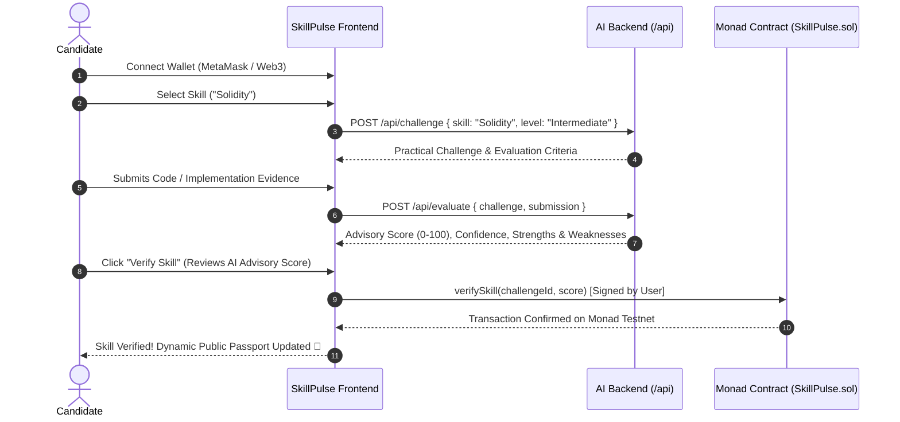

<div align="center">

# ⚡ SkillPulse
### *"Skills change. Proof should stay alive."*

[-836EF9?style=for-the-badge&logo=ethereum&logoColor=white)](https://testnet.monadexplorer.com)
[](https://www.typescriptlang.org/)
[](https://nodejs.org/)
[](https://expressjs.com/)
[](https://opensource.org/licenses/MIT)

<p align="center">
  <b>An AI-powered continuous skill verification protocol anchored on the Monad blockchain.</b>
  <br />
  Move beyond static credentials to living, verifiable proofs of real-time technical mastery.
</p>

[Architecture](docs/PROJECT_SPEC.md) • [API Reference](docs/API.md) • [Backend Guide](docs/BACKEND.md) • [Getting Started](#-getting-started)

---

</div>

## 📌 The Problem

Traditional credentials and certifications are **static snapshots in time**.
* A certificate proves: *"I passed an assessment 3 years ago."*
* It fails to prove: *"I can reliably execute this skill in production today."*

As tooling, languages, and security paradigms evolve, professional skills degrade without continuous practice.

---

## 💡 The Solution: Continuous Skill Verification

**SkillPulse** introduces **Living Skill Proofs**. A user demonstrates competency through realistic, practical challenges evaluated by AI and anchored immutably on the **Monad Testnet**.

Skills have a dynamic lifecycle:
$$\mathbf{ACTIVE} \xrightarrow{\text{time elapsed}} \mathbf{AGING} \xrightarrow{\text{time elapsed}} \mathbf{STALE}$$

* 🟢 **`ACTIVE` (Score $\ge 85$, Freshness $> 80\%$):** Peak verified state.
* 🟡 **`AGING` (Freshness $40\%\text{--}80\%$):** Revalidation recommended.
* 🔴 **`STALE` (Freshness $< 40\%$):** Needs fresh evidence submission to reactivate.

```
       +------------------+
       |   Static Cert    |  --->  "Demonstrated once in 2022"  (Obsolete)
       +------------------+
                vs
       +------------------+
       | SkillPulse Proof |  --->  "Verified Today on Monad"    (Living & Current)
       +------------------+
```

---

## 🔄 The Golden MVP Flow



---

## 🏛️ System Architecture

SkillPulse strictly follows a modular 3-tier structure designed for high reliability and zero downtime:

```text
skillpulse/
├── backend/                  # Developer 3 (AI + Backend Engine)
│   ├── src/
│   │   ├── routes/           # POST /api/challenge, POST /api/evaluate, GET /api/health
│   │   ├── services/         # AIService, PromptService, FallbackEngine
│   │   ├── lib/              # Zod schemas, JSON sanitizer, Logger
│   │   └── test/             # Automated test suite (17/17 tests passing)
│   ├── .env.example          # Environment variables template
│   ├── package.json          # Dependencies & scripts
│   └── tsconfig.json         # TypeScript compiler configuration
├── contracts/                # Developer 1 (Monad Smart Contracts)
│   └── src/
│       └── SkillPulse.sol    # Monad on-chain skill verification contract
├── frontend/                 # Developer 2 (React + Vite + Tailwind + wagmi)
│   └── src/                  # 5 MVP Pages & Reusable Web3 Component System
└── docs/                     # Source of Truth Team Specifications
    ├── PROJECT_SPEC.md       # Master Specification & Team Boundaries
    ├── API.md                # Full JSON Schemas & cURL examples
    └── BACKEND.md            # Local setup & deployment guide
```

---

## 🧠 AI Advisory & Resilience Engine

SkillPulse enforces strict **safety and reliability** invariants:

1. **Advisory AI Only:** The AI backend only evaluates evidence and calculates advisory scores. It **never** signs or executes transactions; on-chain state transitions are exclusively authorized by the user.
2. **Guaranteed Uptime (Deterministic Fallbacks):** If external LLM APIs time out, rate-limit, or lack credentials, the backend instantly falls back to a deterministic heuristic engine. **The demo will never break during evaluation.**
3. **Resilient JSON Recovery:** Cleans Markdown wrappers, repairs trailing commas, and extracts balanced JSON payloads from LLM outputs.

---

## 📡 API Reference

### 1. Generate Challenge
`POST /api/challenge`

Generates an objective, practical engineering challenge for a given skill.

```bash
curl -X POST http://localhost:3001/api/challenge \
  -H "Content-Type: application/json" \
  -d '{"skill": "Solidity", "level": "Intermediate"}'
```

```json
{
  "title": "Reentrancy-Resilient Multi-Token Staking Vault on Monad",
  "description": "Design and implement a secure, gas-efficient StakingVault smart contract in Solidity (>=0.8.20) for the Monad blockchain...",
  "criteria": [
    "Strict adherence to Checks-Effects-Interactions (CEI) pattern and reentrancy resistance",
    "Proper use of custom errors and optimized storage layout for Monad execution",
    "Correct reward math calculation without integer overflow/underflow",
    "Comprehensive event emission for all state-modifying actions"
  ]
}
```

---

### 2. Evaluate Evidence
`POST /api/evaluate`

Advises an objective score ($0\text{--}100$), confidence rating, strengths, and weaknesses based on candidate evidence.

```bash
curl -X POST http://localhost:3001/api/evaluate \
  -H "Content-Type: application/json" \
  -d '{
    "challenge": "Reentrancy-Resilient Multi-Token Staking Vault on Monad",
    "submission": "pragma solidity ^0.8.20;\n\ncontract StakingVault {\n  error InsufficientBalance();\n  mapping(address => uint256) public balances;\n  function stake() external payable { balances[msg.sender] += msg.value; }\n}"
  }'
```

```json
{
  "score": 95,
  "confidence": 82,
  "summary": "The submitted implementation demonstrates solid competency in meeting the core requirements with explicit reentrancy prevention and custom errors.",
  "strengths": [
    "Valid Solidity contract architecture with appropriate pragma declaration",
    "Defensive design with explicit reentrancy prevention guards",
    "Gas-efficient custom error definitions reducing execution costs"
  ],
  "weaknesses": [
    "Consider adding inline NatSpec comments for external functions"
  ]
}
```

---

### 3. Health Check
`GET /api/health`

```json
{
  "status": "healthy",
  "service": "skillpulse-backend",
  "version": "1.0.0",
  "aiConfigured": true,
  "timestamp": "2026-08-22T10:30:00.000Z"
}
```

---

## 🚀 Getting Started

### Prerequisites
- [Node.js](https://nodejs.org/) (v18.0.0 or higher)
- [npm](https://www.npmjs.com/) (v9.0.0 or higher)

### 1. Clone Repository
```bash
git clone https://github.com/VorugantiRahul/xyz.git skillpulse
cd skillpulse
```

### 2. Configure Backend
```bash
cd backend
npm install
cp .env.example .env
```

Edit `.env` (optional — works out of the box with fallback engine):
```ini
PORT=3001
NODE_ENV=development
FRONTEND_URL=http://localhost:5173
AI_API_KEY=your_gemini_or_openai_api_key
```

### 3. Run Automated Tests
```bash
npm test
```

### 4. Start Development Server
```bash
npm run dev
```
Backend API will be live at: `http://localhost:3001`

### 5. Build for Production
```bash
npm run build
npm start
```

---

## 🎨 Design & Color System

SkillPulse uses a dark Web3 aesthetic featuring the Monad Purple brand accent:

| Element | Hex Code | Preview |
| :--- | :--- | :--- |
| **Background** | `#08090D` |  |
| **Surface** | `#11131A` |  |
| **Primary (Monad Purple)** | `#836EF9` |  |
| **Primary Hover** | `#6F5CE7` |  |
| **Success (Active)** | `#22C55E` |  |
| **Warning (Aging)** | `#F59E0B` |  |
| **Danger (Stale)** | `#EF4444` |  |
| **Border** | `#272A36` |  |

---

## ⛓️ Monad Blockchain Deployment Details

* **Network Name:** Monad Testnet
* **Chain ID:** `10143` (`0x279f`)
* **RPC URL:** `https://testnet-rpc.monad.xyz`
* **Currency Symbol:** `MON`
* **Block Explorer:** [https://testnet.monadexplorer.com](https://testnet.monadexplorer.com)

---

## 👥 Hackathon Team Roles

* **Developer 1 (Blockchain):** Solidity smart contracts (`SkillPulse.sol`), Foundry test suite, deployment to Monad Testnet.
* **Developer 2 (Frontend):** React + Vite + Tailwind UI, 5 primary MVP pages, wagmi & viem wallet integration.
* **Developer 3 (AI + Backend):** Express TypeScript API, challenge generator, evidence evaluation service, fallback engine.

---

## 📄 License

This project is licensed under the [MIT License](LICENSE).
